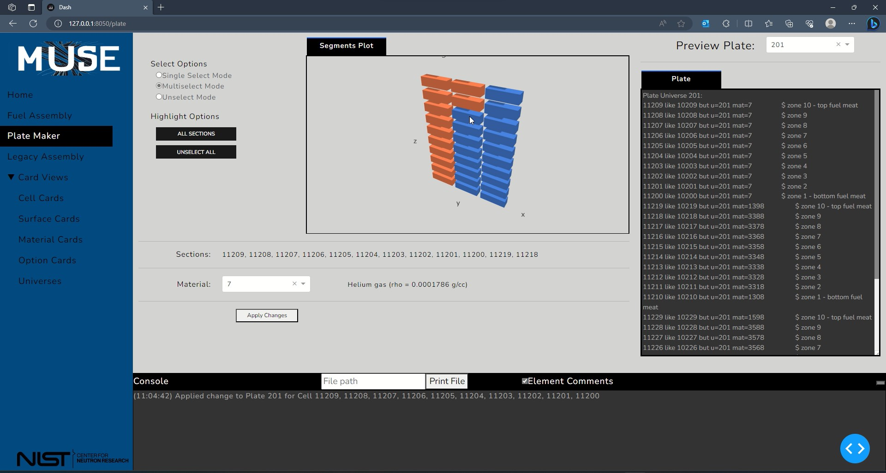

[Watch demonstration](https://youtu.be/VsZNa7hB57g)

## ABOUT
MUSE stands for MCNP Uranium Scout and Editor. This is a project designed to produce Monte Carlo N-Particle transport code (MCNP) card decks using Python. It was built by Duncan Beauch as part of his 11-week CORE internship at NIST. The project has been modified for public release.

## MCNP AND ITS SIGNIFICANCE
Monte Carlo N-Particle Transport Code (MCNP) is a radiation simulation software commonly used to design and analyze nuclear reactors. MCNP enables researchers to create a virtual environment and activate sources of particle radiation to determine how a system will behave over time.

MCNP is developed and maintained by Los Alamos National Laboratory, distributed to licensed users for research in nuclear engineering and medical physics.

## MCNP AT THE NIST CENTER FOR NEUTRON RESEARCH (NCNR)
The NIST Center for Neutron Research (NCNR) implements their reactor design in MCNP in order to perform analyses of criticality calculations, design modifications, and identify potential hazardous conditions.

An MCNP simulation is created from an input file consisting of instruction cards written by the researchers. Because of this, writing an MCNP input file is a tedious and time consuming task for even simple modifications to an existing simulation.

## SOLUTION: MUSE
Our project aims to combat this problem with a user interface capable of creating and managing MCNP input files by allowing the user to directly control reactor parameters from the interface. It can be used to enhance input files, perform sensitivity analyses, and simulate modifications. The program is written in Python and piloted through a Dash app interface.

The main features of this project allow a user to modify types of fuel within the reactor and rearrange the fuel element lattice structure.
